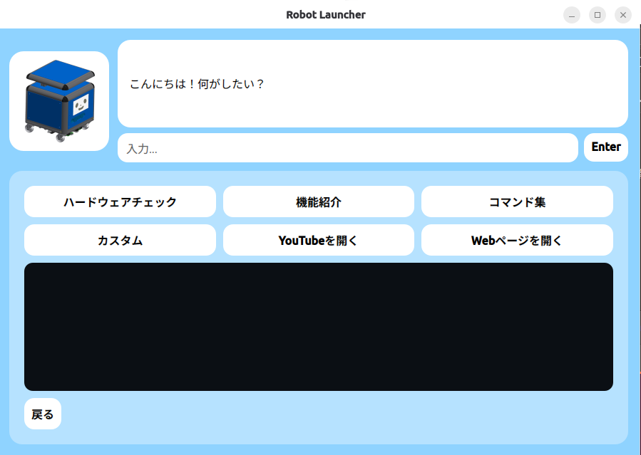

# hello_cube_petit

Cube Petit 実機上で動作するヘルプアプリケーションです。  
起動後、UIからハードウェアチェックや各種リンク、会話機能などを利用できます。



## Independency
- Cube Petit (Ver3.0)
- Ubutnu24.04
- Python 3.12 以上推奨
- [uv](https://github.com/astral-sh/uv)

## Install

```bash
cd ~/work/
git clone <repository_url>
cd hello_cube_petit/
uv sync
```

## Run

```bash
uv run python app/app.py
```

## Function
### 1. Chat Bot (チャットボット)
UI上部の入力欄から会話できます。
（ローカルLLM / ChatGPT連携は今後拡張予定）

### 2. Hardware Check (ハードウェアチェック)
Cube Petit 実機の接続状態をチェックし、結果をまとめて表示します。

### 3. Function Introduce (機能紹介)
Cube Petit の機能説明ページを表示します。（予定）

### 4. Customize Cube Petit (カスタマイズ)
- 顔の色（カラーコード）
- 声設定（voice.yaml出力）
- GPT設定（personality.yaml出力）

### 5. Go to Youtube Channgel (Youtubeチャンネルを見る)
YouTubeチャンネルをブラウザで開きます。

### 6. Go to Cube Petit Webpage (Webページを見る)
Cube Petit のWebページをブラウザで開きます。

## Licence
Apache License 2.0

## Contact
airi.yokochi@g.softbank.co.jp

## Issue
[issue](<repository_url>/issue)
